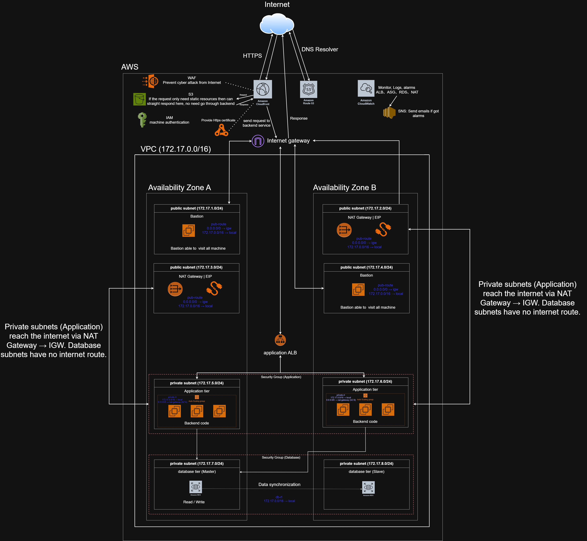

# AWS 3-Tier Architecture — Improvements

This document describes the improved architecture: what is added or changed at the edge, the network layer, the application and database tiers and the operations/security layer.

---

## 1. Overview

| Item               | Value                                             |
| ------------------ | ------------------------------------------------- |
| VPC CIDR           | `172.17.0.0/16`                                   |
| Availability Zones | 2 (AZ A, AZ B), mirrored layout                   |
| Subnets            | 8 total: 4 public + 4 private, each `/24`         |
| Entry point        | CloudFront (single entry for all traffic)         |
| Static content     | S3, served through CloudFront                     |
| Dynamic content    | CloudFront → Application ALB → Auto Scaling group |
| Database           | Amazon RDS, Master (AZ A) + Slave (AZ B)          |

### Subnet map

| Subnet    | CIDR            | AZ  | Contents                                            |
| --------- | --------------- | --- | --------------------------------------------------- |
| Public 1  | `172.17.1.0/24` | A   | Bastion                                             |
| Public 3  | `172.17.3.0/24` | A   | NAT Gateway + EIP                                   |
| Private 5 | `172.17.5.0/24` | A   | Application tier (Auto Scaling group, backend code) |
| Private 7 | `172.17.7.0/24` | A   | Database tier (Master)                              |
| Public 2  | `172.17.2.0/24` | B   | NAT Gateway + EIP                                   |
| Public 4  | `172.17.4.0/24` | B   | Bastion                                             |
| Private 6 | `172.17.6.0/24` | B   | Application tier (Auto Scaling group, backend code) |
| Private 8 | `172.17.8.0/24` | B   | Database tier (Slave)                               |

### Diagram Workflow


---

## 2. Request Flow

```
User
  │  DNS lookup
  ▼
Route 53 ──► (DNS resolver returns CloudFront)
  │
  ▼  HTTPS
WAF ──► CloudFront
            │
            ├── static resources ──► S3 (responds directly, no backend involved)
            │
            └── backend requests ──► Internet Gateway ──► Application ALB
                                                              │
                                                              ▼
                                                  Auto Scaling group (AZ A / AZ B)
                                                              │  Read / Write
                                                              ▼
                                                    RDS Master (AZ A)
                                                              │  Data synchronization
                                                              ▼
                                                    RDS Slave (AZ B)
```

The response travels back along the same path (marked "Response" in the diagram).

---

## 3. Improvements

### 3.1 Edge layer

| Component             | Improvement                                              | Benefit                                                            |
| --------------------- | -------------------------------------------------------- | ------------------------------------------------------------------ |
| **Route 53**          | DNS entry for the domain, pointing to CloudFront         | Single, managed DNS layer                                          |
| **CloudFront**        | Single entry point for all user traffic                  | Caching, lower latency, hides the origin                           |
| **WAF**               | Placed in front of CloudFront                            | Blocks attacks from the internet before they reach the VPC         |
| **HTTPS certificate** | Provided for CloudFront (HTTPS end to end from the user) | Encrypted traffic                                                  |
| **S3**                | Static resources are served straight from S3             | Static requests never hit the backend, which reduces load and cost |

**Routing rule:** if a request only needs static resources, CloudFront answers from S3. Only requests that need backend logic are forwarded to the backend service (via the Application ALB).

### 3.2 Network layer

- **Internet Gateway (IGW)** is the VPC's door to the internet; public subnets route `0.0.0.0/0 → igw`.
- **One NAT Gateway + EIP per AZ** (in public subnets `172.17.3.0/24` and `172.17.2.0/24`), so each AZ has its own outbound path and one AZ failing does not cut off the other.
- **One Bastion per AZ** (public subnets `172.17.1.0/24` and `172.17.4.0/24`). The bastion can reach all machines and is the only administrative entry point.
- **Application tier and database tier are in private subnets**, with no public IPs.
- Database subnets have **no internet route** at all.

### 3.3 Route tables

| Route table         | Used by              | Routes                                                    |
| ------------------- | -------------------- | --------------------------------------------------------- |
| `pub-route`         | Public subnets       | `0.0.0.0/0 → igw`, `172.17.0.0/16 → local`                |
| `private-rt` (AZ A) | Private app subnet A | `172.17.0.0/16 → local`, `0.0.0.0/0 → nat-gateway (AZ A)` |
| `private-rt` (AZ B) | Private app subnet B | `172.17.0.0/16 → local`, `0.0.0.0/0 → nat-gateway (AZ B)` |
| `db-rt`             | Database subnets     | `172.17.0.0/16 → local` only                              |

Private application subnets reach the internet (patches, external APIs) via **NAT Gateway → IGW**. Each AZ uses the NAT Gateway in its own AZ.

### 3.4 Security

| Control                      | Purpose                                                                                |
| ---------------------------- | -------------------------------------------------------------------------------------- |
| WAF                          | Prevents cyber attacks from the internet                                               |
| HTTPS certificate            | Encrypts traffic between users and CloudFront                                          |
| Security Group (Application) | Controls what can reach the backend instances                                          |
| Security Group (Database)    | Controls what can reach RDS (application tier only)                                    |
| IAM machine authentication   | Instances authenticate to AWS services through IAM roles instead of stored credentials |
| Bastion host                 | Single controlled path for administrator access                                        |
| Private subnets              | App and DB tiers are not directly reachable from the internet                          |

### 3.5 Monitoring and alerting

- **Amazon CloudWatch** collects monitoring data, logs and alarms for **ALB, ASG, RDS and NAT**.
- **Amazon SNS** sends an email when an alarm fires.

---
### 3.6 Design Considerations

#### 3.6.1 Protecting the Application ALB from Direct Internet Attacks

Because the Application ALB is Internet-facing, it should be protected from malicious traffic and from clients attempting to bypass the intended CloudFront entry point.

Two complementary approaches can be used:

**Solution 1 — CloudFront + AWS WAF**

* Place **AWS WAF** in front of CloudFront.
* WAF inspects incoming HTTP/HTTPS requests and can block common web attacks, malicious IP addresses, and excessive request rates.
* This allows malicious traffic to be filtered before it reaches the application infrastructure.

**Solution 2 — Restrict ALB Access to CloudFront**

* Configure the **Application ALB Security Group** to allow inbound HTTPS traffic only from CloudFront.
* Do not manually hard-code individual CloudFront IP addresses; use the appropriate AWS-managed CloudFront prefix list where applicable.
* This prevents users from bypassing CloudFront and directly sending requests to the ALB.

The recommended design is to use **both solutions together**:

```text
Internet
    │
    ▼
CloudFront
    │
    ▼
AWS WAF
    │
    ▼
Application ALB
    │
    ▼
Application ASG
```

The ALB Security Group should only allow traffic from the intended CloudFront source.

This provides two layers of protection:

* **WAF** → filters and inspects HTTP/HTTPS requests.
* **Security Group** → prevents direct access to the ALB from unauthorized sources.

---

#### 3.6.2 Reducing Bastion Host Cost While Maintaining Availability

Running a dedicated Bastion host in every Availability Zone provides strong availability, but it also increases infrastructure cost. The architecture can reduce the number of running Bastion instances while still providing cross-AZ recovery.

**Solution 1 — Cross-AZ Bastion Auto Scaling**

Instead of permanently running one Bastion host in every AZ, place the Bastion hosts under an **Auto Scaling group** spanning multiple Availability Zones.

Example configuration:

```text
Minimum capacity: 1
Desired capacity: 1
Maximum capacity: 2
```

Under normal conditions, only one Bastion host is running:

```text
AZ A
 └── Bastion
```

If the Bastion instance fails, the Auto Scaling group can launch a replacement. If the Availability Zone becomes unavailable, the Auto Scaling group can launch the Bastion in another configured AZ.

The main benefit is that only one Bastion instance normally needs to run, reducing cost while still providing cross-AZ recovery.

The trade-off is that there may be a short recovery period when the Bastion host or its Availability Zone fails.

---

**Solution 2 — EIP Failover Between Bastion Hosts**

Another approach is to maintain Bastion capacity across multiple Availability Zones while using a single Elastic IP as the stable administrative entry point.

For example:

```text
                Elastic IP
                    │
          ┌─────────┴─────────┐
          ▼                   ▼
       Bastion A           Bastion B
        AZ A                 AZ B
```

If Bastion A fails:

```text
Bastion A
    ↓
Failure detected
    ↓
EventBridge / CloudWatch Event
    ↓
Lambda
    ↓
Associate Elastic IP with Bastion B
    ↓
Bastion B becomes the active administrative endpoint
```

This allows the administrator to continue using the same public IP address while the active Bastion host changes between Availability Zones.

However, this approach introduces additional components and operational complexity, including EventBridge, Lambda, EIP reassociation and failover logic. Therefore, it is more complex than simply using a cross-AZ Auto Scaling group.

For a production architecture, **AWS Systems Manager Session Manager** can also be considered as an alternative to Bastion hosts, eliminating the need for a publicly accessible administrative server altogether.

---
**Solution 3 — Replace Bastion Hosts with AWS Systems Manager Session Manager**

Instead of maintaining Bastion hosts, administrators can use **AWS Systems Manager Session Manager** to access EC2 instances directly without requiring a public Bastion host.

The architecture becomes:

```text
Administrator
      │
      ▼
AWS Systems Manager
   Session Manager
      │
      ▼
Private EC2 Instances
```

The application instances can remain in private subnets with **no public IP addresses**.

**Benefits:**

* **Lower cost** — No Bastion EC2 instances or Bastion-related Elastic IPs are required.
* **Smaller attack surface** — No publicly accessible SSH server is required.
* **No inbound SSH port** — Port 22 does not need to be exposed to the internet.
* **Simpler architecture** — Eliminates the need to maintain Bastion hosts across multiple Availability Zones.
* **No Bastion HA management** — There is no need for Bastion Auto Scaling, EIP failover, or Lambda-based failover logic.
* **Private infrastructure remains private** — Administrators can access private EC2 instances without giving them public IP addresses.
* **Centralized access control** — Access can be controlled using IAM policies and permissions.
* **Better auditability** — Session Manager can integrate with AWS logging services to record and monitor administrative sessions.

For this architecture, **Session Manager is the preferred solution when direct SSH access through a Bastion host is not required**. It provides administrative access while keeping the application infrastructure private and reducing both infrastructure cost and operational complexity.


## 4. Summary of changes

1. CloudFront becomes the single entry point, with WAF and HTTPS in front.
2. Static resources are served from S3, so they bypass the backend.
3. Route 53 handles DNS for the domain.
4. Everything is mirrored across two AZs: NAT Gateway, Bastion, application tier, and database tier.
5. The database has a Master/Slave pair with data synchronization across AZs.
6. Application and database tiers are fully private; the database has no internet route.
7. CloudWatch + SNS provide monitoring and email alerts.
8. IAM provides machine authentication.
9. Bastion hosts can be replaced with AWS Systems Manager Session Manager to reduce cost, eliminate public SSH access, reduce the attack surface, and simplify cross-AZ administration.
