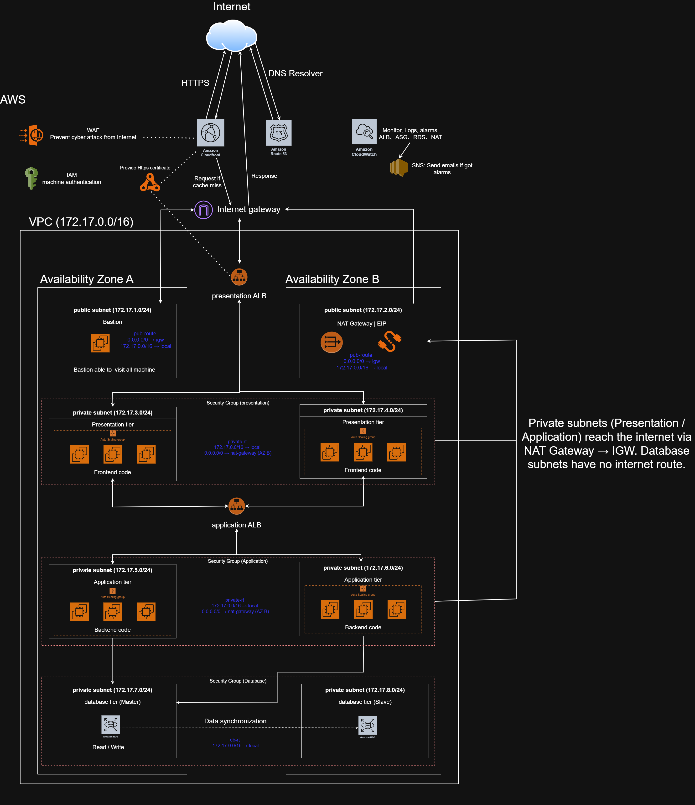

# Highly Available 3-Tier Web Architecture on AWS
 
A production-style three-tier web architecture on AWS, designed with reliability, security and observability in mind. The environment spans two Availability Zones inside a custom VPC (`172.17.0.0/16`) and isolates the presentation, application and database tiers in separate subnets.
 

 
> **Note:** This environment was built manually through the AWS Console as a hands-on learning project. Rebuilding it with Infrastructure as Code (Terraform) is the planned next step (see [Possible Improvements](#possible-improvements)).
 
## Architecture Highlights
 
- **Edge and traffic flow:** Route 53 → CloudFront (with AWS WAF and an ACM-issued HTTPS certificate) → Internet Gateway → presentation ALB → application ALB → database. CloudFront serves cached content and forwards to the origin only on a cache miss.
- **Network isolation:** Each AZ has a public subnet (Bastion host / NAT Gateway) plus private subnets for the presentation, application, and database tiers. Database subnets have no route to the internet.
- **High availability:** The presentation and application tiers run in Auto Scaling Groups across 2 AZs behind separate Application Load Balancers. The database tier uses Amazon RDS with a primary in one AZ and synchronous replication to a standby in the other.
- **Security:** Per-tier security groups, private route tables (outbound access through NAT only), a Bastion host as the single administrative entry point, IAM roles for machine authentication, and WAF in front of CloudFront.
- **Observability:** CloudWatch metrics, logs, and alarms on ALB, ASG, RDS, and NAT Gateway, with SNS email notifications when alarms fire.
## Network Layout
 
| Subnet                 | CIDR          | AZ  | Purpose      |
| ---------------------- | ------------- | --- | ------------ |
| Public                 | 172.17.1.0/24 | A   | Bastion host |
| Public                 | 172.17.2.0/24 | B   | NAT Gateway  |
| Private (Presentation) | 172.17.3.0/24 | A   | Frontend ASG |
| Private (Presentation) | 172.17.4.0/24 | B   | Frontend ASG |
| Private (Application)  | 172.17.5.0/24 | A   | Backend ASG  |
| Private (Application)  | 172.17.6.0/24 | B   | Backend ASG  |
| Private (Database)     | 172.17.7.0/24 | A   | RDS primary  |
| Private (Database)     | 172.17.8.0/24 | B   | RDS standby  |
 
## Benefits of This Architecture
 
- **High availability:** Every tier runs across two AZs. ALBs route around unhealthy targets, Auto Scaling Groups replace failed instances, and RDS Multi-AZ fails over automatically.
- **Elastic scalability:** The presentation and application tiers scale out and in independently based on load, so each tier can be sized for its own traffic pattern.
- **Defense in depth:** Security is layered: WAF and HTTPS at the edge, tier-specific security groups, private subnets, a database with no internet route, and IAM roles instead of long-lived credentials.
- **Clear separation of concerns:** Each tier can be deployed, scaled, secured, and troubleshot on its own. A problem in the frontend tier does not directly affect the database.
- **Good observability:** CloudWatch alarms plus SNS email notifications give early warning on the key components (ALB, ASG, RDS, NAT).
- **Industry-standard pattern:** The design maps directly to the AWS Well-Architected reliability and security pillars, which makes it easy to reason about and extend.
## Drawbacks and Trade-offs
 
- **Cost:** This is the biggest downside. Even with low traffic, many resources bill continuously:
  - Two Application Load Balancers (hourly charge each)
  - A NAT Gateway (hourly charge plus per-GB data processing)
  - EC2 instances in two AZs for two tiers (ASG minimum capacity is always running)
  - RDS Multi-AZ, which runs a full standby instance that serves no traffic
  - WAF, and a Bastion host that is idle most of the time
- **Operational complexity:** Many moving parts (VPC, 8 subnets, route tables, security groups, 2 ALBs, 2 ASGs, RDS) mean more to configure, monitor and keep consistent.
- **Manual provisioning:** The environment was built by hand in the AWS Console, so it is hard to reproduce and prone to configuration drift until it is codified in IaC.
- **Remaining single points of failure:** The single NAT Gateway (AZ B) is an AZ-level weakness (see the interview questions below).
- **Over-engineered for small workloads:** For a low-traffic site, this much infrastructure is more than needed. The design pays off when availability and independent scaling really matter.
- **Server management overhead:** EC2 instances still need OS patching, AMI updates, and capacity tuning, which a managed or serverless service would handle for us.
## Interview Questions May Be Asked
 
### 1. There is only one NAT Gateway (in AZ B), but both AZs' private route tables point to it. Isn't that a single point of failure?
 
Yes. It is an AZ-level single point of failure and it was a deliberate cost trade-off for this learning project, since each NAT Gateway is billed per hour plus per GB processed.
 
**Impact if AZ B goes down:**
- Inbound user traffic is **not** affected. It goes through CloudFront and the ALBs, which are multi-AZ.
- Instances in AZ A's private subnets lose **outbound** internet access (OS patching, package downloads, calls to external APIs) until the NAT is restored.
- Cross-AZ traffic from AZ A to the NAT in AZ B also adds data transfer cost and latency.

**What I would change in production:** 
- deploy one NAT Gateway per AZ and point each AZ's private route table to the NAT Gateway in the same AZ. This removes the cross-AZ dependency and keeps each AZ self-sufficient.
 
### 2. The diagram says "Master / Slave". Is this a Multi-AZ deployment or a read replica?

This project uses **RDS Multi-AZ**, so technically it is a **primary / standby** pair, not master/slave:
- The standby receives **synchronous** replication and exists purely for **failover**. It does not serve read traffic.
- If the primary or its AZ fails, RDS automatically promotes the standby and updates the DNS endpoint, so the application reconnects without a code change.
By contrast, a **read replica** uses **asynchronous** replication and is meant for **scaling reads**. It can lag behind the primary and failover to it is not automatic by default. The two features solve different problems (availability vs. read scalability) and can be combined.
 
### 3. What happens if an entire Availability Zone fails?
 
- Route 53 / CloudFront keep working because they are global services.
- The ALBs stop routing to unhealthy targets in the failed AZ and continue to serve from the healthy AZ.
- Auto Scaling Groups launch replacement instances in the remaining AZ to restore capacity.
- RDS fails over to the standby in the surviving AZ.
- Known gap: the single NAT Gateway issue above if the failed AZ is AZ B.
### 4. Why two separate load balancers (presentation ALB and application ALB)?
 
It separates the tiers so each can scale, be secured and fail independently. The application tier is only reachable from the presentation tier's security group, never directly from the internet. Each tier's ASG scales on its own load pattern.
 
### 5. Why use a Bastion host and what are the risks?
 
It provides a single, controlled entry point for administrative SSH access to private instances, instead of exposing them. 

**Risks:** it is an internet-facing host that must be tightly restricted (source IP allow-list, key-only auth, patched). A more modern alternative is **AWS Systems Manager Session Manager**, which needs no inbound ports or SSH keys and gives audited access through IAM.
 
### 6. Why was this built manually and how would you make it reproducible?
 
I built it by hand first to understand how each AWS component (VPC, route tables, security groups, ALB, ASG, RDS) connects. The weakness of manual setup is configuration drift and no repeatability. The next step is to codify the whole environment in Terraform, store state remotely (S3 + DynamoDB locking), and deploy through a CI pipeline.
 
## Design Notes: Networking and Architecture Q&A

Notes from reviewing this design. They cover the routing details that are easy to get wrong, how the edge services fit in and where the design could go next.

### 1. What is the `local` route? Does it cover one subnet or the whole VPC?

The `local` route covers the **entire VPC CIDR** (`172.17.0.0/16`), across all subnets and both AZs. For example, an instance in `172.17.3.0/24` reaches an instance in `172.17.5.0/24` through `local`.

- It is created automatically and cannot be edited or deleted.
- It only provides routing. Security Groups (and NACLs) still decide whether the traffic is actually allowed.
- It must use the VPC CIDR. Writing a single `/24` (such as `172.17.0.0/24`) is wrong, because none of the real subnets fall inside it.

### 2. Does `0.0.0.0/0 → NAT` send all outbound traffic through the NAT Gateway?

No. Route tables use the **most specific match**:

| Destination                    | Matching route          | Result                                      |
| ------------------------------ | ----------------------- | ------------------------------------------- |
| `172.17.5.20` (inside the VPC) | `172.17.0.0/16 → local` | Stays inside the VPC, never touches the NAT |
| `8.8.8.8` (public internet)    | `0.0.0.0/0 → NAT`       | Goes to the NAT, then the IGW               |

`0.0.0.0/0` is the default route: everything that does not match a more specific route. So only traffic that is **not** destined for the VPC uses the NAT.

The NAT only supports connections **initiated from inside**. Responses return automatically, but the internet cannot start connections to private instances. That is why private subnets use a NAT instead of an IGW route.

### 3. The NAT Gateway is inside the same VPC. Why can't private instances just use `local` to get to the internet?

Instances can reach the NAT's private IP through `local`, but they are not trying to reach the NAT. They are trying to reach a **public address**. Route tables only look at the destination IP: `8.8.8.8` is not in `172.17.0.0/16`, so `local` does not match, and with no other route the packet is dropped.

`0.0.0.0/0 → NAT` supplies the missing next hop. The full path is:

1. The instance sends a packet to `8.8.8.8` (source `172.17.5.20`).
2. The private route table matches `0.0.0.0/0 → NAT` and forwards it to the NAT.
3. The NAT replaces the source IP with its Elastic IP and forwards it using the public subnet's route table (`0.0.0.0/0 → igw`).
4. The IGW sends it to the internet. The response returns along the same path, and the NAT translates it back to the private IP.

Analogy: a printer on a home LAN is reached directly (`local`), but for websites the computer needs a default gateway to hand traffic to. `0.0.0.0/0 → NAT` is that default gateway setting.

### 4. What do the route tables for this project look like?

| Route table  | Associated subnets                    | Routes                                                      |
| ------------ | ------------------------------------- | ----------------------------------------------------------- |
| `public-rt`  | 172.17.1.0/24, 172.17.2.0/24          | `172.17.0.0/16 → local` `0.0.0.0/0 → igw`                |
| `private-rt` | 172.17.3.0/24, 4.0/24, 5.0/24, 6.0/24 | `172.17.0.0/16 → local` `0.0.0.0/0 → nat-gateway (AZ B)` |
| `db-rt`      | 172.17.7.0/24, 8.0/24                 | `172.17.0.0/16 → local`                                     |

Common mistakes to avoid:

- **The `local` route must be the VPC CIDR**, not a single `/24`.
- **Private route tables need an explicit `0.0.0.0/0 → NAT` route.** `local` alone gives no internet access.
- **A NAT Gateway has no route table of its own.** Route tables are associated with subnets. The NAT sits in a public subnet, which uses `public-rt`.
- **Routing is decided by route tables, not security groups.** Security groups attach to instances (ENIs) and only control which traffic is allowed.
- **Database subnets get the `local` route only.** RDS does not need to initiate outbound internet connections, so leaving out the NAT route is more secure.

In the AWS Console: VPC → Route tables → Create route table → Edit routes → Subnet associations.

### 5. What are the trade-offs of using a single NAT Gateway in AZ B?

It is a common cost-saving choice for learning and test environments. Both AZs' private subnets share one `private-rt` that points to the NAT in AZ B.

- If AZ B fails, private instances in **both** AZs lose outbound internet access. Inbound user traffic through the ALBs is not affected.
- Outbound traffic from AZ A crosses AZs, which adds data transfer charges.
- For production, use one NAT per AZ with a private route table per AZ (see Interview Question 1).

### 6. How do Route 53, CloudFront, ACM, CloudWatch, and IAM fit into the diagram?

None of them live inside a subnet. They are drawn outside the VPC (IAM, Route 53, and CloudFront are global; ACM and CloudWatch are regional).

Request path: `User → Route 53 (DNS only) → CloudFront → IGW → Presentation ALB → three tiers`

| Service    | Placement                        | Connection                               | Purpose                                            |
| ---------- | -------------------------------- | ---------------------------------------- | -------------------------------------------------- |
| Route 53   | Near the top, by the Internet    | Dashed line to CloudFront (alias record) | Maps the domain to CloudFront                      |
| CloudFront | Between the Internet and the IGW | Solid traffic line                       | Caching, acceleration, a layer in front of the ALB |
| ACM        | Outside the VPC                  | Dashed lines to CloudFront and the ALB   | HTTPS certificates                                 |
| CloudWatch | Side of the diagram              | Dashed lines to ALB, ASG, RDS, NAT       | Monitoring, logs, alarms                           |
| IAM        | Side, as Role icons              | Dashed line to EC2 (instance profile)    | Permissions for machines                           |

Key points:

- **ACM needs two certificates:** one in **us-east-1** for CloudFront, and one in the VPC's Region for the ALB's HTTPS listener.
- **Lock down the ALB** so it only accepts CloudFront. The ALB's security group should allow only the CloudFront managed prefix list, so nobody can bypass CloudFront.
- **Route 53 usually needs two records:** `www` → CloudFront, and an origin domain → ALB, so CloudFront's origin certificate matches.
- **CloudWatch** alarms drive ASG scaling. EC2 memory and disk metrics need the CloudWatch Agent.
- **IAM is not a network node.** It is drawn with dashed lines or Role icons, not solid traffic arrows.

Diagram convention: bold solid lines for traffic, thin dashed lines for management, monitoring, and authorization.

### 7. Is this a 3-tier or a 4-tier architecture?

It is still **3-tier**. Tiers are logical **application layers** (presentation, application, database). Route 53, CloudFront, ACM, CloudWatch, and IAM are edge, infrastructure, and management services, not application tiers. Having four kinds of subnets (public, presentation, application, database) does not make it 4-tier either, because the public subnets hold network components (Bastion, NAT, ALB nodes), not application logic.

It would only become 4-tier or n-tier if a separate logical layer were added to the application itself, such as an independent API layer or a dedicated cache service layer.

### 8. What else would make this more production-ready?

In priority order:

1. **Security and data protection:** WAF, Secrets Manager (no DB passwords in code), KMS encryption for RDS/EBS/S3, SSM Session Manager instead of a Bastion, CloudTrail, and VPC Endpoints (S3 gateway endpoint; interface endpoints for SSM, CloudWatch, and Secrets Manager).
2. **High availability and backup:** one NAT per AZ, RDS automated backups with point-in-time recovery and deletion protection (optionally AWS Backup), ASG with at least 2 instances across both AZs and ELB health checks, RDS Proxy if connection management becomes an issue.
3. **Performance:** S3 for static assets as a CloudFront origin, ElastiCache (Redis) for sessions and hot data, RDS Read Replicas for read-heavy workloads.
4. **Operations and delivery:** IaC (Terraform or CloudFormation), CI/CD with Launch Templates/AMIs, CloudWatch alarms to SNS, ALB access logs and VPC Flow Logs, separate dev/staging/prod environments with AWS Budgets.
5. **Disaster recovery (as needed):** define RTO and RPO first, then choose backup-restore, pilot light, or active-active.

Splitting the documentation into three diagrams keeps it readable: a network and data-flow diagram, a security diagram, and a CI/CD and operations diagram. Many of these items are also tracked in [Possible Improvements](#possible-improvements).

### 9. Where should AWS WAF be attached, and does it save money to put it on CloudFront?

Only the **internet-facing entry point** needs WAF. The application ALB is internal and does not need it, so the number of ALBs is not a cost concern.

AWS WAF is billed per Web ACL, per rule, and per million requests, regardless of what it is attached to. A single Web ACL can be shared across multiple CloudFront distributions, ALBs, and other resources. The listed rates are $5 per Web ACL per month, $1 per rule per month, and $0.60 per million requests (check the [AWS WAF pricing page](https://aws.amazon.com/waf/pricing) for current figures).

One possible difference is request volume: WAF on CloudFront inspects every viewer request including cache hits, while WAF on an ALB only sees requests that reach the origin. At this project's traffic, the difference is negligible.

**Decision: attach WAF to CloudFront.**

- Malicious requests are blocked at the edge before reaching the VPC.
- The ALB only accepts CloudFront traffic, so a second WAF on the ALB would be redundant.
- One Web ACL is enough. For CloudFront, create it with scope `CLOUDFRONT` in **us-east-1**.
- Attach it to the presentation ALB instead only if CloudFront is not used and users hit the ALB directly.

### 10. Which metrics should drive Auto Scaling for each tier?
 
Both ASGs use **target tracking** scaling policies instead of hand-written step scaling. A target value is set, and the ASG creates and manages the CloudWatch alarms and adjusts the instance count automatically.
 
| Tier         | Primary metric             | Target value          | Why                                                                                                                            |
| ------------ | -------------------------- | --------------------- | ------------------------------------------------------------------------------------------------------------------------------ |
| Presentation | `ALBRequestCountPerTarget` | Set from load testing | The frontend is usually lightweight, so CPU can stay low even under heavy request volume. Request count reflects the real load |
| Application  | `ASGAverageCPUUtilization` | 50 to 60%             | Business logic is typically CPU-bound, so CPU is the most direct signal                                                        |
 
Notes:
 
- One ASG can have multiple target tracking policies, for example CPU and `ALBRequestCountPerTarget` on the application tier. Scale-out happens if **any** metric exceeds its target, and scale-in only when **all** metrics are below target, which is the safer behavior.
- With CloudFront in front, only cache misses reach the ALB, so `ALBRequestCountPerTarget` measures the load that actually hits the origin.
**Choosing the target value:** load test a single instance (k6, JMeter, or ab), find the requests per instance at roughly 60 to 70% CPU, and use that number (with some headroom) as the `ALBRequestCountPerTarget` target. Without load test data, start with 50 to 60% CPU and tune from observed behavior.
 
**Metrics not suited for scaling:**
 
- **Memory:** not a default metric and requires the CloudWatch Agent. Use it as a custom metric only if the application is memory-bound.
- **Latency and 5xx errors:** too noisy, and scaling out does not necessarily fix them (the cause may be a slow database or a bug). Better used for CloudWatch alarms and SNS notifications.
- **Database metrics:** an ASG controls EC2 count, not database capacity.
- **Network in/out:** only relevant for workloads that move large files.
**Supporting settings:**
 
- **Min = 2 and an explicit Max.** Min 2 keeps at least one instance per AZ. A Max cap prevents runaway cost during traffic spikes or attacks.
- **Account for database connections on the application tier.** More instances means more connections, and RDS has a `max_connections` limit. Check connection pool settings before raising Max, and consider RDS Proxy.
- **Use ELB health checks** rather than EC2-only checks, so an instance with a failed application is replaced even if the machine is still running. Set a health check grace period long enough for startup.
- **Set instance warmup** to the real time an instance needs before it can take traffic, so new instances do not skew the metric and trigger repeated scale-out.
- Scale-in is slower than scale-out by design in target tracking and does not need to be tuned aggressively.

## Possible Improvements
 
### 1. Remove the presentation tier: host the frontend on S3 + CloudFront
 
If the frontend is a static site (for example a React/Vue single-page app built into HTML/JS/CSS), it does not need EC2 instances, an ASG, or a presentation ALB at all.
 
**Proposed design:** Route 53 → CloudFront (+ WAF) → S3 bucket for static assets, and CloudFront forwards API paths (e.g. `/api/*`) to the application tier.
 
**Why it is better:**
- **Lower cost:** Removes the presentation-tier EC2 instances, the presentation ALB, and the NAT traffic they generate. S3 storage and CloudFront delivery are billed by usage and are typically far cheaper for static content.
- **Higher availability with less effort:** S3 is a regional service with built-in multi-AZ durability, and CloudFront is a globally distributed service. There are no instances to patch, replace, or scale.
- **Better performance:** Static files are cached at edge locations close to users instead of being served from EC2 in a single region.
- **Smaller attack surface:** The bucket stays private and is only readable by CloudFront through Origin Access Control (OAC). There are no frontend servers to harden or SSH into.
- **Simpler operations:** Deploying a new frontend version becomes uploading files to S3 and invalidating the CloudFront cache.
**Caveat:** This only works for static or client-side rendered frontends. If the presentation tier does server-side rendering (SSR), it still needs compute (EC2, containers, or Lambda). The application tier must also be reachable from CloudFront, for example through a public ALB restricted to CloudFront or a CloudFront VPC origin.
 
### 2. Other improvements
 
- **One NAT Gateway per AZ** to remove the AZ-level single point of failure.
- **Replace the Bastion host with SSM Session Manager** to remove inbound SSH exposure and get IAM-audited access.
- **Rebuild with Terraform** (modules per tier, remote state in S3 with locking) for repeatable, reviewable deployments.
- **Add a CI/CD pipeline** for application and infrastructure changes.
- **Cost optimization:** Use VPC endpoints (e.g. for S3) to reduce NAT data charges, right-size instances, and consider Savings Plans or Reserved Instances for steady-state workloads.
- **Stronger observability:** Add dashboards, application-level metrics and logs, and define SLOs with alerting tied to them.
### Roadmap (Go to further steps!)
 
- [X] Migrate the frontend to S3 + CloudFront and decommission the presentation tier [3-tier-improvements](./HA_Presentation_Improvements.md)
- [X] One NAT Gateway per AZ [3-tier-improvements](./HA_Presentation_Improvements.md)
- [X] Replace the Bastion host with SSM Session Manager [3-tier-improvements](./HA_Presentation_Improvements.md)
 
**Feedback and suggestions are always welcome. If you spot any mistakes or have ideas for improvement, feel free to let me know.**